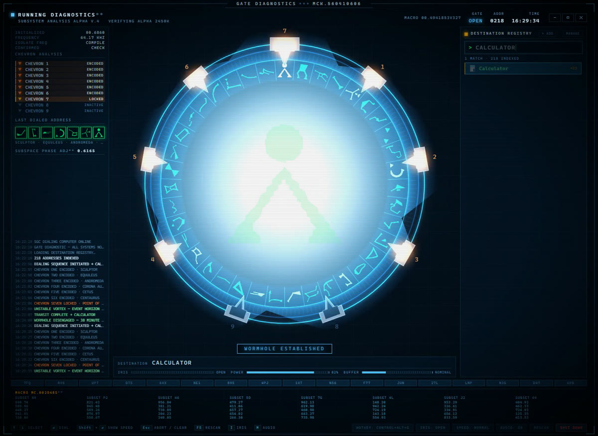
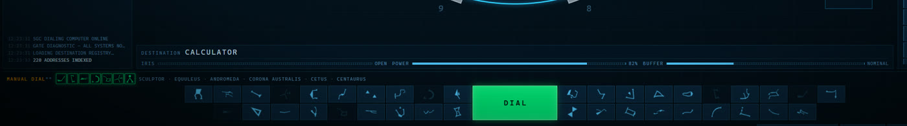
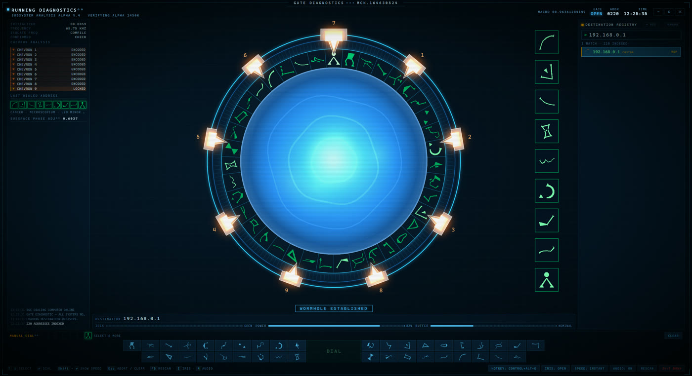
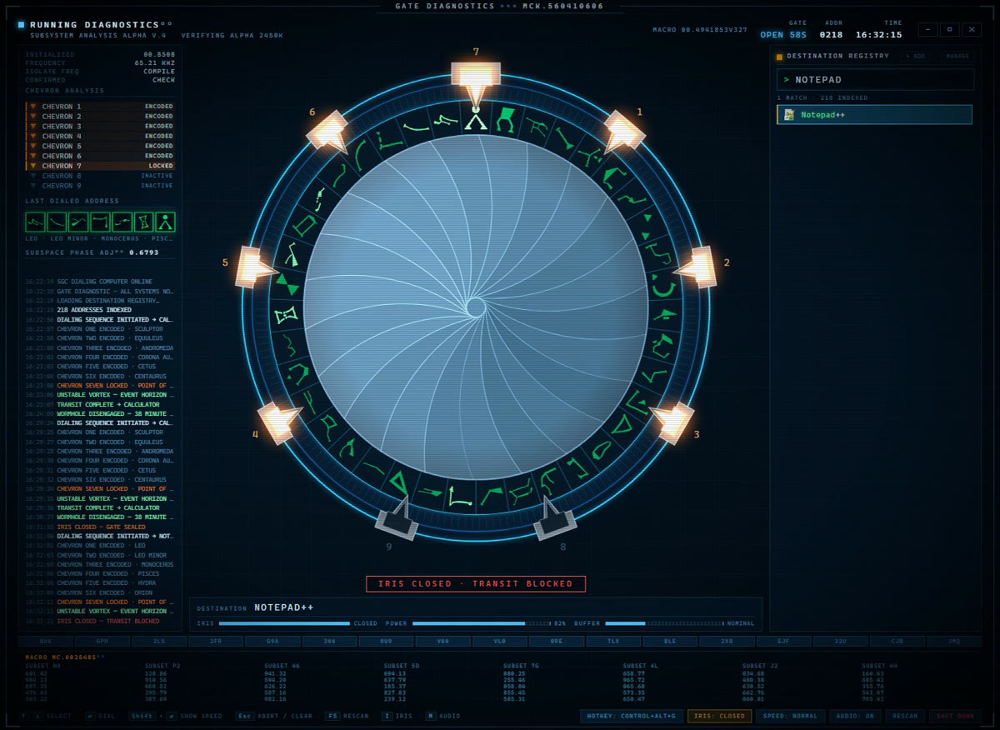

# Stargate Command

An app launcher for Windows and Linux that dials your programs like the SG-1
gate.

Type a program name, press Enter, and the gate dials it. The ring spins, seven
chevrons lock one at a time, the kawoosh fires, and your program opens.



It is slower than clicking an icon. That is the point.

## Download

Both builds are on the [releases page](../../releases/latest).

**Windows:** run the installer. Windows 10 or 11, 64-bit, nothing else to
install.

**Linux:** download the AppImage, make it executable, and run it.

```bash
chmod +x Stargate-Command-*.AppImage
./Stargate-Command-*.AppImage
```

The Windows build is not code-signed, so it will show a blue "Windows protected
your PC" box. Click **More info**, then **Run anyway**. A signing certificate
costs a few hundred dollars a year and this is a hobby project. If you would
rather not trust a stranger's binary, the source is right here and builds in
two commands.

## Using it

| Key | Does |
| --- | --- |
| *type* | filter your programs |
| <kbd>Enter</kbd> | dial it, about 10 seconds |
| <kbd>Shift</kbd>+<kbd>Enter</kbd> | dial the full 28-second version |
| <kbd>Tab</kbd> | change speed, including an instant one |
| <kbd>Esc</kbd> | abort the dial, clear the search, or hide the window |
| <kbd>I</kbd> | open or close the iris |
| <kbd>M</kbd> | audio on or off |
| <kbd>F5</kbd> | rescan for new programs |
| *click glyphs* | dial an address by hand on the DHD along the bottom |
| <kbd>Ctrl</kbd>+<kbd>Alt</kbd>+<kbd>G</kbd> | summon it from anywhere, rebindable |

Press **MANAGE** to hide entries you never launch, or to give one an address
of your choosing with **ADDR**. Press **+ ADD** for anything the Start Menu
misses: a program, a document, a folder, a web link, or another machine.

## The details I got carried away on

**Every program has its own address.** The name is hashed into six
constellations plus the Point of Origin, so it never changes. Photoshop is
always Canis Minor, Perseus, Pisces, Capricornus, Lynx, Sculptor.

**All 39 glyphs are the real ones**, traced from reference artwork rather than
drawn by hand, so the symbols on the ring are the actual constellations.

**The chevrons light in the right order.** They are not evenly spaced: 1, 2, 3
down the right, 4, 5, 6 back up the left, 7 at the top. Each symbol spins to
top dead center to be grabbed, exactly as on screen.

**You can dial by hand.** The row of symbols along the bottom is a DHD: 38
keys, one per constellation, with DIAL in the middle. Press six of them and
hit it, and whatever lives at that address opens. Get it wrong and the gate
still locks all seven chevrons before telling you there is nothing there.

You are not asked up front how far you are dialing. Six symbols is a seven
chevron address; keep going and an eighth makes it a nine chevron one, which
is how you reach a remote machine by hand.



**Or set your own.** Press MANAGE, then ADDR on any entry, and choose the six
symbols yourself. RESET puts it back to the derived one.

**Remote machines get nine chevrons.** Add one with a hostname or IP and it
dials the full nine-chevron sequence before opening a remote desktop session,
because seven chevrons is a local address and somewhere that is not your own
machine deserves the long dial. Windows uses mstsc; Linux uses FreeRDP,
Remmina or rdesktop, whichever you have.



**The sounds are the real ones.** Chevron locks, the ring, the kawoosh, the
iris, the shutdown and the DHD keys. There is a synthesized version of each
behind them, so deleting the sound files degrades rather than breaks it.

**The iris works.** It is a real leaf shutter, 22 blades, and the spiral falls
out of the geometry rather than being drawn on.



Close it and the gate still dials perfectly, but nothing comes through and your
program does not open. That is not a bug.

## Build it yourself

```bash
npm install
npm start          # run it
npm run dist       # build the installer
```

Windows and Linux both build (`npm run dist` / `npm run dist:linux`). There
are no runtime dependencies beyond Electron itself: the glyph tracing, the
fallback audio and the PNG decoding are all hand-rolled.

## Worth knowing

It reads your Start Menu and Desktop shortcuts to build the program list, and
pulls each program's icon. That is all it looks at.

**It makes no network connections of its own.** No telemetry, no update check,
nothing phoning home. You can verify that with a firewall, or by reading
`electron/main.js`. Settings live in `%APPDATA%\Stargate Command` on Windows
and `~/.config/Stargate Command` on Linux, and survive an upgrade.

The one exception is the obvious one: a remote destination starts your system's
Remote Desktop client, and that connects where you told it to. Nothing else
does. Passwords are never stored or handled here either - the RDP client asks
for them and your OS keeps them.

## More

[docs/DESIGN.md](docs/DESIGN.md) has the long version: how the glyphs were
traced, why the iris is drawn the way it is, how Store apps are launched, and
the Windows gotchas that cost real time.

## License and credits

Stargate, the SGC, the gate designs, the glyph artwork and the sound effects
all belong to MGM. This is an unofficial fan project, made for fun, not
affiliated with or endorsed by the rights holders.

**The MIT license covers the code only.** It is not mine to place any license
on the Stargate material in `assets/` and `public/sfx/`, and it does not.

Linux support was contributed by [@jkoehler11](https://github.com/jkoehler11).

The sounds are optional as far as the program is concerned: delete
`public/sfx/` and it falls back to the synthesized audio it shipped with
originally, which is built from oscillators and noise. Drop in your own seven
files under the same names and it uses those instead.
